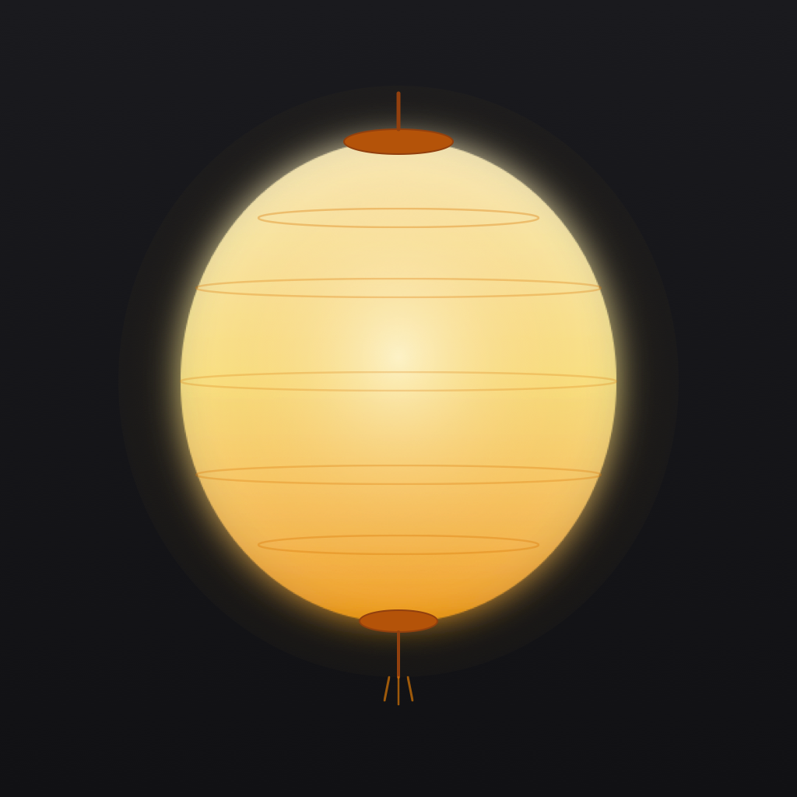
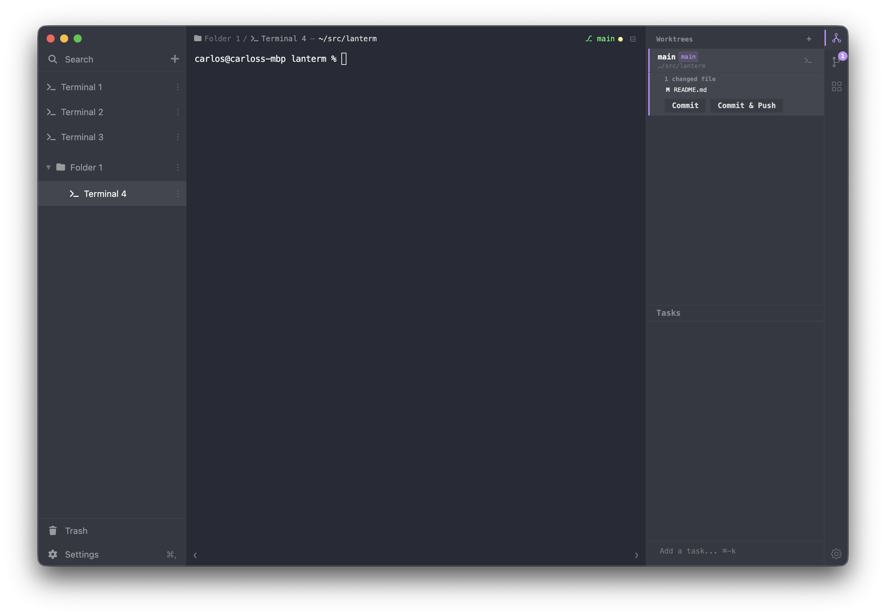

<p align="center">
  
</p>

<h1 align="center">LanTerm</h1>

<p align="center">
  <strong>A modern, GPU-accelerated terminal emulator for macOS</strong>
</p>

<p align="center">
  
  
  
  
</p>

---

LanTerm is a terminal emulator for macOS built with Electron, React, and xterm.js. It features GPU-accelerated rendering, split panes, full session persistence, a unified command palette, vim-style hints mode, smart clickable links, 10 color themes, and an extensible plugin sidebar with 6 built-in plugins. Every keybinding is rebindable.

<p align="center">
  
</p>

## 🚀 Getting Started

```bash
# Install dependencies (includes native node-pty rebuild for Electron)
npm install

# Start dev server with hot reload
npm run dev
```

Requires macOS, Node.js >= 18, and npm.

```bash
npm run build      # Production build
npm run preview    # Preview production build
npm test           # Run all tests (Playwright e2e + Vitest unit)
npm run test:unit  # Unit tests only
```

---

## ✨ Highlights

- **GPU-accelerated rendering** via WebGL with canvas fallback
- **Split panes** — horizontal splits with keyboard navigation
- **Session persistence** — terminals, folders, and layout survive restarts
- **Command palette** — commands, terminal search, and shell history in one place
- **Hints mode** — keyboard-driven link activation (vim-style)
- **10 built-in themes** — plus light/dark UI and per-terminal overrides
- **Plugin sidebar** — 6 built-in plugins, extensible architecture
- **Smart links** — Cmd+click file paths, git hashes, and URLs
- **Fully rebindable** — 30+ commands with customizable keybindings

---

## 🖥️ Terminal Core

- GPU-accelerated rendering (WebGL → canvas fallback)
- Split panes with `⌘D`, navigate with `⌘⌥↑` / `⌘⌥↓`
- Automatic CWD tracking via OSC 7 with lsof fallback
- Full session persistence — terminals, splits, scroll state, and working directories are saved and restored
- Duplicate any terminal with `⌘⇧D`
- Inline search with `⌘F`
- Trash & recovery — deleted terminals are soft-deleted for 30 days

## 🎨 Themes

10 built-in terminal color schemes:

| | | |
|---|---|---|
| Default Dark | Default Light | Dracula |
| Solarized Dark | Solarized Light | One Dark |
| Monokai | Nord | Gruvbox Dark |
| Tokyo Night | | |

The app supports light and dark UI modes, and each terminal can override the global theme.

## 🔍 Command Palette

Open with `⌘P`. Three input modes controlled by prefix:

| Prefix | Mode | Description |
|--------|------|-------------|
| `>` | Commands | Search all commands, plugin actions, and custom commands |
| `/` | Find | Search visible terminal content across all terminals |
| `!` | History | Search shell command history |
| *(none)* | All | Combined view with history-boosted sorting |

## 🏷️ Hints Mode

Press `⌘⇧U` to activate hints mode. Every clickable target in the terminal viewport gets a letter label — type the label to activate it. No mouse needed.

Detected targets:
- **URLs** — `http://` and `https://` links
- **File paths** — absolute, relative, `~/` paths with optional `:line:col`
- **Git hashes** — 7–40 character hex commit references

## 🔗 Smart Links

Cmd+click to interact with detected patterns:

- **File paths** → opens in your editor (supports `path/file.ts:10:5` line:col syntax)
- **Git hashes** → runs `git show <hash>` in the terminal
- **URLs** → opens in the default browser

## 📁 Folders & Organization

- Hierarchical folders with drag-and-drop
- Custom folder icons
- Favorites for quick access
- Rename terminals with `⌘L`

## 🧩 Plugin System

Six built-in sidebar plugins:

| Plugin | Description |
|--------|-------------|
| **Git** | Commit graph for the active repository |
| **Claude** | Usage stats and recent Claude Code session history |
| **Files** | Browse files in the current directory |
| **Worktrees** | List, create, and remove git worktrees |
| **Buttons** | Custom buttons that run scripts in the background |
| **Vim Shortcuts** | Searchable vim keyboard shortcut reference |

Plugins are installed/uninstalled at runtime via the Plugin Gallery. See [Creating Plugins](#creating-plugins) below.

## ⌨️ Keyboard Shortcuts

### Terminals

| Action | Shortcut |
|--------|----------|
| New terminal | `⌘T` |
| Close terminal | `⌘W` |
| Previous terminal | `⌘⌥←` |
| Next terminal | `⌘⌥→` |
| Duplicate terminal | `⌘⇧D` |
| Rename terminal | `⌘L` |

### Panes

| Action | Shortcut |
|--------|----------|
| Split pane | `⌘D` |
| Focus up | `⌘⌥↑` |
| Focus down | `⌘⌥↓` |
| Move pane left | `⌘⇧←` |
| Move pane right | `⌘⇧→` |

### View

| Action | Shortcut |
|--------|----------|
| Toggle left sidebar | `⌘←` |
| Toggle right sidebar | `⌘→` |
| Command palette | `⌘P` |
| Hints mode | `⌘⇧U` |
| Find in terminal | `⌘F` |
| Settings | `⌘,` |
| New window | `⌘⇧N` |

### Font & Zoom

| Action | Shortcut |
|--------|----------|
| Increase font | `⌘=` |
| Decrease font | `⌘-` |
| Reset font | `⌘0` |
| Zoom in | `⌘⇧=` |
| Zoom out | `⌘⇧-` |
| Reset zoom | `⌘⇧0` |

### Plugins

| Action | Shortcut |
|--------|----------|
| Toggle prompt | `⌘K` |
| Activate plugin 1–9 | `⌘1` – `⌘9` |

All keybindings are fully rebindable in Settings.

---

## 🏗️ Architecture

LanTerm follows Electron's three-process model:

```
src/
├── main/              # Electron main process
│   ├── index.ts       # Window creation, IPC registration
│   ├── ptyManager.ts  # PTY lifecycle, CWD tracking
│   └── stateManager.ts # JSON persistence
├── preload/
│   └── index.ts       # contextBridge → window.termAPI
├── renderer/          # React UI
│   ├── App.tsx        # Root layout, keybindings, state hydration
│   ├── store/         # Zustand state management
│   ├── components/    # Sidebar, TerminalPane, Settings, etc.
│   └── designTokens.ts # Shared style constants
├── shared/            # Cross-process types & constants
│   ├── types.ts       # AppState, Folder, Session, Settings
│   ├── ipcChannels.ts # IPC channel definitions
│   └── keybindings.ts # Command definitions & binding resolution
└── plugins/           # Modular sidebar plugin system
    ├── registry.ts    # Plugin collection
    ├── git/
    ├── claude-history/
    ├── file-browser/
    ├── worktree/
    ├── vim-shortcuts/
    └── buttons/
```

State is managed with **Zustand** (with `subscribeWithSelector`), hydrated from a JSON file on launch, and saved on structural changes with a 1-second debounce.

All IPC flows through typed constants in `src/shared/ipcChannels.ts` and the `window.termAPI` bridge — renderer code never touches `ipcRenderer` directly.

## Creating Plugins

Each plugin lives in `src/plugins/<name>/` and needs at minimum:

1. **`manifest.ts`** — plugin metadata (`id`, `name`, `description`, `order`, `PanelComponent`)
2. **`renderer/<Name>Panel.tsx`** — the sidebar panel component

Register in `src/plugins/registry.ts` and add to the default `installedPlugins` array in the Zustand store.

For plugins that need main-process access (filesystem, child processes), add IPC channels, handlers, and preload bridge methods. See `CLAUDE.md` for the full registration checklist.

## Tech Stack

| Layer | Technology |
|-------|------------|
| Runtime | Electron 33 |
| UI | React 18 |
| Terminal | xterm.js 5, WebGL addon |
| PTY | node-pty |
| State | Zustand 5 |
| Language | TypeScript 5 |
| Build | electron-vite, Vite 5 |
| Icons | FontAwesome 7 |

---

## License

All rights reserved.
